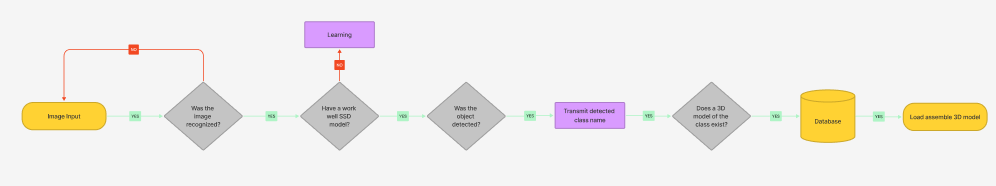

# 2D Single Image to 3D Model Conversion


## 프로젝트 소개
- 2D 싱글 이미지에서 인공지능이 학습한 object들을 detect하고

  검출된 object class에 해당하는 3D 모델 데이터를

  데이터베이스에서 물리엔진 가상공간으로 로드해

  자동생성조립하는 시스템

## 목적

- 이미지를 입력하면 3D 모델로 출력하는 컴퓨터 비전과 딥러닝 기술이 연구되고 있지만

단일 이미지에서 공간의 일그러짐이나 형태의 왜곡 없이 3D 모델을 출력하거나

이미지 안에 정밀 대상 개체의 모든 구성 요소를 빠트리지 않고 세세히 파악하여 3D 모델로 출력하는 시스템은 아직 존재하지 않는다.

- 많은 대상 개체 및 구성요소의 이미지 데이터를 학습시킨 model을 통해

이미지에서 요소를 검출하고 검출된 데이터를 바탕으로 가상환경 내에 미리 제작,

저장된 요소 데이터를 로드해 해당 개체가 미지의 존재여도 그 개체를 가상환경 내에 구현할 수 있도록 하는 것이 목적

## 플로우 차트



## 모델
### SSD ResNet101 V1 FPN 1024x1024(RetinaNet101)

### Pre-Trained Model

[Checkpoint](https://drive.google.com/file/d/1XnoWH6bi4n9nEOe_rzetteViZiZwJI-e/view?usp=drive_link)

[Weight](https://drive.google.com/file/d/1R6vlE2SIOABENCBoEKwlra19e9DHiQIW/view?usp=drive_link)

```
training_demo/
├─ ...
├─ pre-trained-models/
│  └─ ssd_resnet101_v1_fpn_1024x1024/
│     ├─ checkpoint/
│     ├─ saved_model/
│     └─ pipeline.config
└─ ...
```

## 데이터 셋

```
training_demo/
├─ annotations/
├─ exported-models/
├─ images/
│ ├─ test/
│ └─ train/
├─ models/
└─ pre-trained-models/
```

- 기계공학적 부품요소가 명확한 자전거를 예시로 프로젝트를 진행하였다.
- 자전거 부품 클래스
  - Frame, Saddle, Seatpost, Crank, Chain, Chainring, Wheel, Handle, Bike
- 전체 이미지 12,111장
- 부품 3D 모델 8개

## 전처리

- LabelImg tool 사용

```
python labelImg.py
```

- label_map.pbtxt 작성

```
  item {
  id : 1
  name : 'frame'
  }
```

## 훈련

- train, test holdout

```
python partition_dataset.py -x -i [PATH_TO_IMAGES_FOLDER] -r 0.1
```

- train 데이터 제작

```
python generate_tfrecord.py -x [PATH_TO_IMAGES_FOLDER]/train -l [PATH_TO_ANNOTATIONS_FOLDER]/label_map.pbtxt -o [PATH_TO_ANNOTATIONS_FOLDER]/train.record
```

- test 데이터 제작

```
python generate_tfrecord.py -x [PATH_TO_IMAGES_FOLDER]/test -l [PATH_TO_ANNOTATIONS_FOLDER]/label_map.pbtxt -o [PATH_TO_ANNOTATIONS_FOLDER]/test.record
```

- 모델 훈련

```
python model_main_tf2.py --model_dir=models/my_ssd_resnet50_v1_fpn --pipeline_config_path=models/my_ssd_resnet101_v1_fpn/pipeline.config
```

## 레퍼런스

<https://github.com/tensorflow/models/tree/master/research/object_detection>
<https://paperswithcode.com/paper/ssd-single-shot-multibox-detector>
